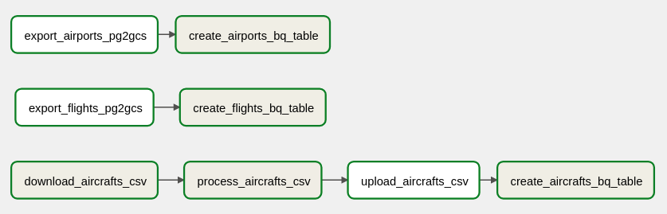

# Kadmos Data Pipeline

## Introduction

I will be setting up data pipelines to extract, transform, and load (ETL) disparate data sources into Google BigQuery. The data sources are:

* **aircrafts** - CSV
* **airports** - PGSQL DB
* **flights** - PGSQL DB

We will be assuming that **aircrafts** is in a Google storage bucket, and **airports** and **flights** are in separate Postgres databases.

As part of the requirements set forth by the stakeholders, only the `en` value should be extracted from the `model` field.

## Tools

I will be using Apache Airflow as the tool for building out the data pipelines. Airflow's pipelines follow the directed acyclic graph (DAG) concept, which encapsulates the relationships and dependencies of the tasks defined in the pipeline job. Another important feature to note is that tasks in a DAG will never flow back to an earlier task, hence the word "acyclic". This is to prevent infinite loops.

## Project Files

The files relevant to this project are:

* `docker-compose.yml` - compose file to spin up Airflow container
* `dags/flights.py` - python file defining the ETL piplines
* `dags/scripts/transform_aircrafts.py` - utility script to transform **aircrafts** data

I will not be going over the `docker-compose.yml` file but if you want to spin up the container inside your machine, you are free to do so by issuing the command `docker-compose up -d`. The web URL is `localhost:8080` and the web admin login is user=*airflow*, password=*airflow*.

**NOTE:** Spinning up the container does not automatically mean that the tasks in `flights.py` will run. You will have to set up the Google cloud connectors in the *Admin* menu and then reference them in the DAG script in the lines that are commented with `# configure`. In addition, global variables for the scripts (`scripts_dir`) and temp (`temp_dir`) directory have to be defined. These variables should be set to `/opt/airflow/dags/scripts` and `/opt/airflow/tmp` respectively. You will also have the set up your own Postgres instances, storage bucket, and BigQuery dataset and have them be reflected in the DAG script.

## dags/flights.py

`flights.py` contains 8 tasks. The simplest way to delineate how the tasks run is using a diagram.



**aircrafts data tasks**

1. *download_aircrafts_csv* will download the aircrafts CSV file from GCS into the local file system. This file is saved inside a temporary directory that is defined upfront as a global variable. Because there may potentially be other DAGs using this temporary folder, I leverage the DAG's ID and run ID to create a unique filename for my downloaded file to prevent naming conflicts.
2. *process_aircrafts_csv* will process and transform the downloaded CSV file from the previous step. Here, I'm using the `transform_aircrafts.py` uility script to read each row, extract the `en` value from the `model` column, and writing the new row into a new file. An explanation of this utility script is written further down in the readme.
3. *upload_aircrafts_csv* will upload the transformed CSV file to a storage bucket. I have named the destination file to be static, so that if the DAG is re-run, then the file will simply be overwritten. The bucket was created beforehand.
4. *create_aircrafts_bq_table* will create a native BigQuery table using the uploaded CSV from the previous step. Again, I'm using a static name with a write disposition of `WRITE_TRUNCATE` so that the table would be overwritten if the DAG is re-run.

**airports data tasks**

1. *export_airports_pg2gcs* will export the airports data from Postgres to GCS. The filename has been kept static.
2. *create_airports_bq_table* will create a native BigQuery table using the exported data from the previous step. Again, I'm using a static name with a write disposition of `WRITE_TRUNCATE`.

**flights data tasks**

1. *export_flights_pg2gcs* will export flights data from Postgres to GCS. Filename is static.
2. *create_flights_bq_table* will create a native BiqQuery table using the exported data from the previous step. Used static name and write disposition of `WRITE_TRUNCATE`.

## dags/scripts/transform_aircrafts.py

This script simply creates two file context managers. One to read the downloaded CSV file, and the other to write to a new CSV file. Within the context managers, the script will process each row (do the JSON extraction) and then write the processed row to the new CSV file. The script is optimized such that it reads (and writes) the CSV row-by-row so that in the event that the CSV is "so big", we don't get memory overflow (e.g. worker only has 4GB memory and CSV file is 5GB).

## Questions & Solutions

**Question 1**

> Display the number of flights by arrival airport for the timezone "*Europe/Samara*" showing the following attributes:
> `[airport_code | airport_name | num_flights]`
>
> Which was the busiest airport?

**Solution**

Since the flights data has some flight statuses as "Scheduled", "Cancelled", or "Delayed", I will interpret the question as arrival events having already occurred.

```sql
SELECT
    a.arrival_airport AS airport_code,
    b.airport_name,
    COUNT(a.flight_id) AS num_flights
FROM `directed-cove-130017.flights.flights` AS a
LEFT JOIN `directed-cove-130017.flights.airports` AS b
ON a.arrival_airport = b.airport_code
WHERE a.status = "Arrived"
    AND b.timezone = "Europe/Samara"
GROUP BY
    a.arrival_airport,
    b.airport_name
ORDER BY
    COUNT(a.flight_id) DESC
```

airport_code | airport_name | num_flights
--- | --- | ---
ULV | "{""en"": ""Ulyanovsk Baratayevka Airport"", ""ru"": ""Баратаевка""}" | 197
ULY | "{""en"": ""Ulyanovsk East Airport"", ""ru"": ""Ульяновск-Восточный""}" | 97
KUF | "{""en"": ""Kurumoch International Airport"", ""ru"": ""Курумоч""}" | 93
ASF | "{""en"": ""Astrakhan Airport"", ""ru"": ""Астрахань""}" | 74
IJK | "{""en"": ""Izhevsk Airport"", ""ru"": ""Ижевск""}" | 31

**Question 2**

> Display the following attributes:
> `[airport_code | airport_name | aircraft_model | num_aircrafts]`
>
> What are the two aircraft most commonly used per arrival airport to cover the timezone "*Europe/Samara*"

**Solution**

Again, I will interpret the question as arrivals having already occurred to be considered in the query.

```sql
WITH aggAircrafts AS (
    SELECT
        a.arrival_airport AS airport_code,
        b.airport_name,
        c.model AS aircraft_model,
        COUNT(a.flight_id) AS num_aircrafts,
    FROM `directed-cove-130017.flights.flights` AS a
    INNER JOIN `directed-cove-130017.flights.airports` AS b
    ON a.arrival_airport = b.airport_code
    INNER JOIN `directed-cove-130017.flights.aircrafts` AS c
    ON a.aircraft_code = c.aircraft_code
    WHERE a.status = "Arrived"
        AND b.timezone = "Europe/Samara"
    GROUP BY
        a.arrival_airport,
        b.airport_name,
        c.model
),
topAircrafts AS (
    SELECT
        *,
        ROW_NUMBER() OVER (PARTITION BY airport_code ORDER BY num_aircrafts DESC) AS top
    FROM aggAircrafts
)
SELECT * EXCEPT(top)
FROM topAircrafts
WHERE top <= 2
```

airport_code | airport_name | aircraft_model | num_aircrafts
--- | --- | --- | ---
ASF | "{""en"": ""Astrakhan Airport"", ""ru"": ""Астрахань""}" | Bombardier CRJ-200 | 69
ASF | "{""en"": ""Astrakhan Airport"", ""ru"": ""Астрахань""}" | Airbus A319-100 | 5
KUF | "{""en"": ""Kurumoch International Airport"", ""ru"": ""Курумоч""}" | Cessna 208 Caravan | 31
KUF | "{""en"": ""Kurumoch International Airport"", ""ru"": ""Курумоч""}" | Boeing 767-300 | 31
ULV | "{""en"": ""Ulyanovsk Baratayevka Airport"", ""ru"": ""Баратаевка""}" | Sukhoi Superjet-100 | 153
ULV | "{""en"": ""Ulyanovsk Baratayevka Airport"", ""ru"": ""Баратаевка""}" | Boeing 767-300 | 31
IJK | "{""en"": ""Izhevsk Airport"", ""ru"": ""Ижевск""}" | Bombardier CRJ-200 | 31
ULY | "{""en"": ""Ulyanovsk East Airport"", ""ru"": ""Ульяновск-Восточный""}" | Cessna 208 Caravan | 62
ULY | "{""en"": ""Ulyanovsk East Airport"", ""ru"": ""Ульяновск-Восточный""}" | Bombardier CRJ-200 | 35

## Considerations

The datasets used in this case study were small, and therefore the data pipelines used a naive method for ingesting and loading the datasets. In a real-life scenario, where data may arrive in larger quantities, such as the **flights** data, the pipeline can be configured to ingest a day's worth of data on a daily basis and then append that data to the BigQuery table. Processing by batches also uses a smaller memory footprint as we aren't querying the entire dataset and in the case failures, at least we have batched data persisted from previous runs.

We could also use BigQuery external tables. This has the advantage of letting the data reside in GCS while keeping the storage costs low, at the expense of decreased performance. However, that performance hit may be minimal if we design the tables to be efficient, such as utilizing partitions. A good design comes down to understanding the business requirements and how analysts plan to query the tables.

In terms of tools for production, Airflow is a good starting point as it can cover a lot of various ETL tasks. If we are using GCP for a majority of our business operations, we can consider using Cloud Composer, which is their managed version of Airflow on GCP. In addition, Google has other pipeline tools such as DataFlow that we can leverage if needed. There are also 3rd party tools that complement Airflow such as Airbyte and dbt, but at the time of this writing, I'm not too familiar with them to comment about them. If there is ever a time when Airflow is not sufficient to do the job, then we can explore those other tools.
